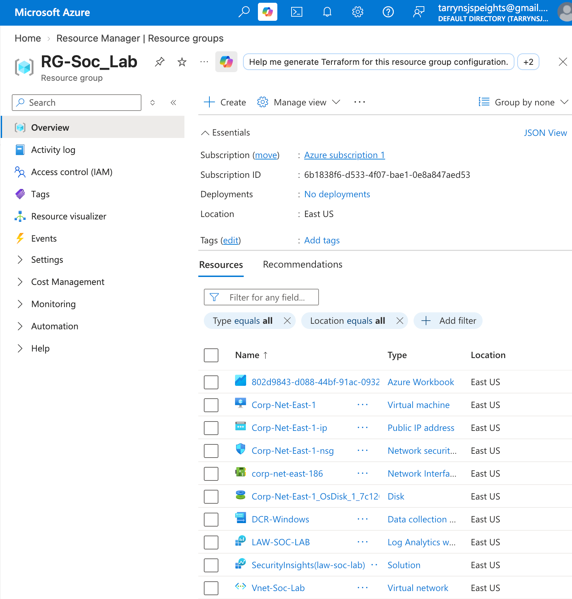
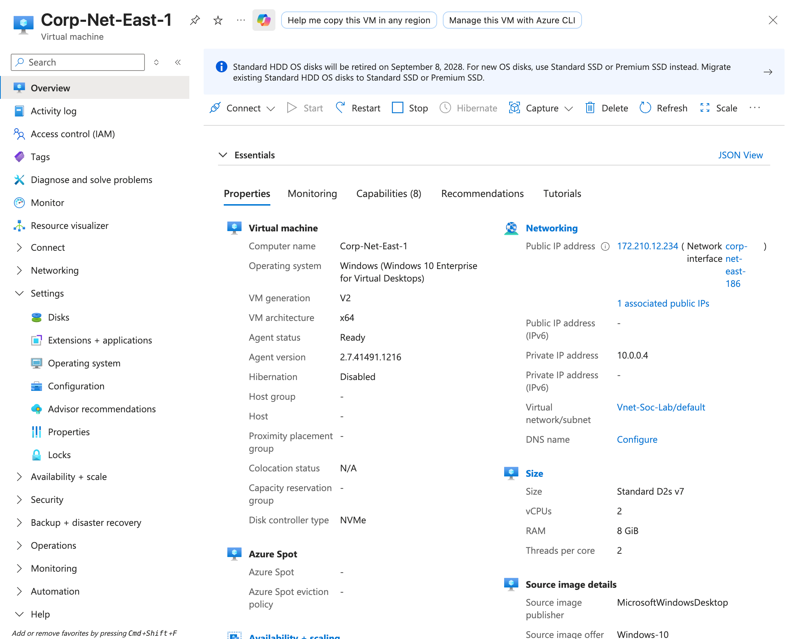
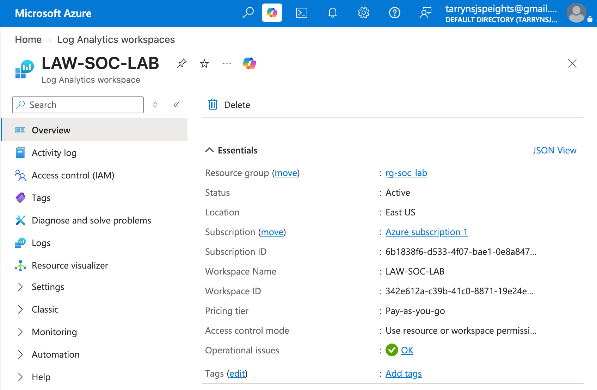
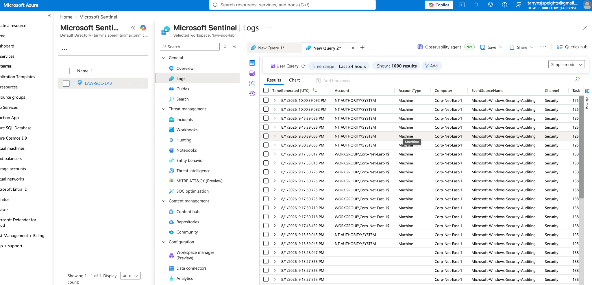
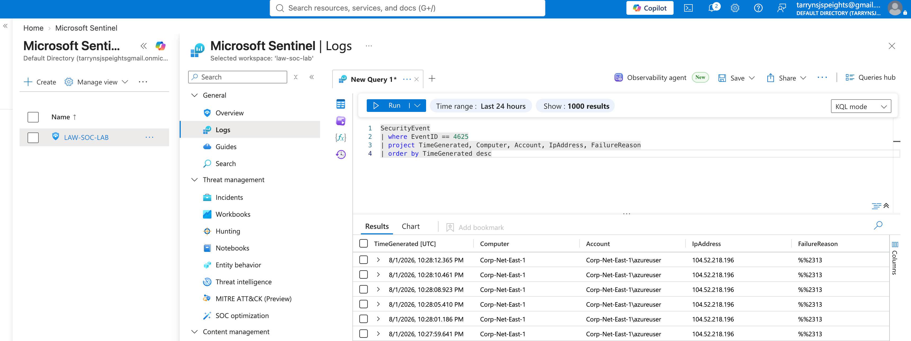

# Azure SOC Implementation with Microsoft Sentinel

## Overview

This project demonstrates the deployment of a cloud based Security Operations Center using Microsoft Azure and Microsoft Sentinel. A Windows 10 virtual machine was deployed in Azure and connected to a Log Analytics Workspace for centralized security monitoring.

The project focuses on detecting failed Windows authentication attempts using Microsoft Sentinel and Kusto Query Language.

## Objectives

- Deploy a Windows 10 virtual machine in Microsoft Azure.
- Configure a Log Analytics Workspace.
- Enable Microsoft Sentinel.
- Collect Windows Security Event Logs.
- Generate failed authentication attempts.
- Detect failed logons using Kusto Query Language.
- Document the results.

## Technologies Used

- Microsoft Azure
- Microsoft Sentinel
- Azure Virtual Machines
- Log Analytics Workspace
- Windows 10
- Windows Security Event Logs
- Kusto Query Language
- Remote Desktop Protocol

## Environment

| Component | Technology |
|-----------|------------|
| Cloud Platform | Microsoft Azure |
| SIEM | Microsoft Sentinel |
| Endpoint | Windows 10 Virtual Machine |
| Log Collection | Log Analytics Workspace |
| Query Language | Kusto Query Language |

## Project Process

1. Created an Azure resource group.
2. Deployed a Windows 10 virtual machine.
3. Created a Log Analytics Workspace.
4. Enabled Microsoft Sentinel.
5. Connected the virtual machine to the workspace.
6. Verified that Windows Security Event Logs were being collected.
7. Generated failed authentication attempts.
8. Queried Windows Event ID 4625 in Microsoft Sentinel.

## Failed Logon Detection

Windows Event ID 4625 records failed authentication attempts.

The following KQL query was used to identify failed logons:

```kusto
SecurityEvent
| where EventID == 4625
| project TimeGenerated, Computer, Account, IpAddress, FailureReason
| order by TimeGenerated desc
```

The query successfully returned failed authentication events from the Windows 10 virtual machine, confirming that Microsoft Sentinel was collecting and analyzing Windows security logs.

## Screenshots

### Azure Resource Group



### Windows 10 Virtual Machine



### Log Analytics Workspace



### Microsoft Sentinel



### Failed Logon Detection



## Skills Demonstrated

- Cloud Security
- Microsoft Azure
- Microsoft Sentinel
- SIEM Configuration
- Windows Security Event Analysis
- Log Analysis
- Kusto Query Language
- Threat Detection
- Security Monitoring

## Lessons Learned

This project provided hands on experience deploying Microsoft Sentinel, configuring centralized log collection, writing a KQL query, and detecting failed Windows authentication attempts in a cloud environment.
